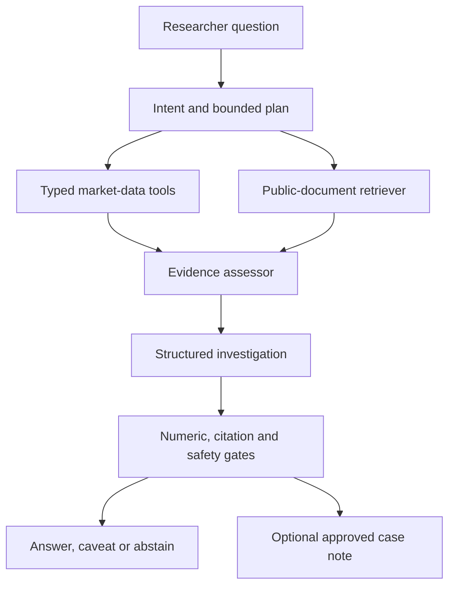

# NEM Event Intelligence Agent

## Independent GitHub project design using public electricity-market data

**Status: design only.** The repository, model, evaluation results, and demo described below have not yet been implemented. All figures in a future demo must come from a reproducible run. This document is the canonical design for a new, independent project.

> Repository note: this is the original design document, kept verbatim for reference. What was actually built, and every departure from this design, is recorded in `docs/progress.md` and `docs/decisions.md`.

### One-sentence pitch

An analyst asks what happened during an unusual electricity-market interval. A bounded AI workflow retrieves public market data and documentation, calls deterministic analysis tools, and returns a structured investigation with verifiable numbers, citations, uncertainty and a clear separation between evidence and hypotheses.

**Scope:** public National Electricity Market (NEM) data. No organisation-specific process, customer data, private forecast, retailer position, internal document or workplace code is used. The reference user is an independent energy-market researcher. The project does not place trades or control grid assets.

## 1. A real question worth answering

> "What happened around this SA1 price spike? How did price, operational demand and generation move; did the demand forecast miss; what does AEMO's public documentation or an event report actually say?"

The analyst can choose `SA1`, `NSW1` or another NEM region and a historical date. The demo event is chosen **after checking that the actual source files and any relevant report exist**. The system has three investigation modes within one product:

| Intent | Analyst question | Verifiable outcome |
| --- | --- | --- |
| `market_event_review` | What changed around a high-price or low-price interval? | Timeline of dispatch price, operational demand, selected generation changes and weather context, each with timestamps and source IDs. |
| `forecast_review` | What did the region's issued demand forecasts say, and what actually happened? | As-of forecast runs, actual demand, forecast error and data-revision status. |
| `source_explanation` | What do “operational demand”, “scheduled demand”, or a market event report mean here? | Answer from retrieved public documents, with quotations and page/section citations. |

The output never labels a coincident weather or generation change as the **cause** of a price spike without an authoritative event report or a clearly labelled, independently evaluated analytical model. It distinguishes actual observations, forecasts, post-event weather context, published findings and hypotheses.

## 2. Real, public datasets and the exact role of each

| Dataset | Official source | Grain and use | Boundary |
| --- | --- | --- | --- |
| Dispatch price and market context | [AEMO Dispatch](https://www.aemo.com.au/energy-systems/electricity/national-electricity-market-nem/data-nem/market-management-system-mms-data/dispatch) | Public 5-minute regional price, demand-related dispatch fields and interconnector information; identify and plot a price event. | A dispatch demand field is not automatically interchangeable with operational demand. |
| Issued operational-demand forecasts | [AEMO Operational Demand](https://www.aemo.com.au/energy-systems/electricity/national-electricity-market-nem/data-nem/operational-demand-data), `PUBLIC_FORECAST_OPERATIONAL_DEMAND_HH` | Half-hourly regional forecasts; retain file publication/issue time and target interval to compare successive forecasts fairly. | A published point forecast is not a P10/P90 estimate. |
| Actual operational demand | Same AEMO source, actual half-hourly and update files | Compare forecast against the corresponding actual; apply and record subsequent corrections. | The AEMO 5-minute operational-demand series is described as interpolated from half-hourly values; do not mistake it for independent meter readings. |
| Generation observations | [AEMO Generation and Load](https://www.aemo.com.au/energy-systems/electricity/national-electricity-market-nem/data-nem/market-management-system-mms-data/generation-and-load), dispatch SCADA | Optional unit-level changes around the event. | A drop in SCADA output alone does not prove an outage or explain market price causally. |
| Weather after the event | [NASA POWER hourly API](https://power.larc.nasa.gov/docs/services/api/temporal/hourly/) at documented coordinates | Historical hourly temperature, wind or solar context; record dataset, resolution and UTC conversion. | Model-derived/gridded historical weather is not necessarily the forecast available at the earlier decision time. |
| Public source documents | [AEMO market event reports](https://www.aemo.com.au/energy-systems/electricity/national-electricity-market-nem/nem-events-and-reports/market-event-reports) and AEMO data/dispatch documentation | RAG corpus for metric definitions, market mechanics and any report **actually relevant to the chosen event**. | An unrelated report cannot be cited as an explanation for another event. |

**Availability:** AEMO provides current and archived files with differing retention windows. A setup script must first verify a selected date and store the exact file URLs, publication times, checksums and retrieval date. A failed download is surfaced as missing evidence, never silently replaced with invented values. Public availability and permission to use a source do not guarantee accuracy or suitability for operational decisions.

**Attribution and redistribution:** Keep `data/SOURCES.md` with URLs, attribution, timestamps, licence and dataset-page notices. [AEMO's copyright page](https://www.aemo.com.au/privacy-and-legal-notices/copyright-permissions) permits reuse of AEMO material with appropriate attribution; the dataset pages also provide use and quality disclaimers. Publish code and small derived example outputs by default, and let users retrieve raw archives from the publisher. Attribute NASA POWER following its [referencing guidance](https://power.larc.nasa.gov/docs/referencing/). No subscribed weather products are needed.

## 3. Data engineering and an honest time model

All source adapters normalise to an append-only event store with `source`, `source_url`, `file_sha256`, `published_at`, `valid_at`, `region`, `metric`, `value`, `unit`, `revision_id`, and `retrieved_at`. Parsed rows retain source row IDs, not just an aggregated DataFrame. Repository fixtures include a small, attributed **derived** event slice and a script to fetch full source files on demand.

Join 5-minute price to half-hourly demand by an explicit interval policy; preserve the original resolutions in plots and tables. Store times in UTC and present Australian regional local time with DST rules. For an **as-of** investigation, retrieve only forecasts and documents published by the selected decision time. For a **post-event** review, actual demand and historical weather may appear, visibly labelled as later evidence. Revisions are applied according to a named policy, and the response shows whether initial or revised actuals were used.

This temporal contract is testable: the system must not answer "what was known at 09:00?" with a weather reanalysis or AEMO correction published later.

## 4. Architecture: bounded agency, real tool calling

The LLM classifies the question into a closed intent enum, extracts region/time parameters using a schema, may request **at most two** allowlisted extra diagnostic tools, and synthesises the final structured answer. Each intent has required tools selected by a fixed playbook. The backend validates tool names, argument schemas, time bounds and requested units; all arithmetic, database queries and approvals are deterministic. No arbitrary SQL, shell, Python execution or unrestricted browser tool is available to the model.

Use the OpenAI Responses API for a live demonstration of function calling and structured outputs. Include a fixture-based offline replay adapter for a no-key demo and deterministic CI; report separately what replay verifies and what was measured with a live model. Python, Pydantic, FastAPI and a small LangGraph state machine are reasonable implementation choices. Keep domain calculations outside the orchestration framework. One bounded workflow demonstrates the engineering more clearly than several independent agents with overlapping duties.

**Model and prompt design:** choose a lower-cost candidate for typed intent/parameter extraction and compare at least two candidates for report synthesis on a held-out set. Select by tool-argument accuracy, groundedness, latency and measured cost, then pin the model versions in reports. Prompts separate system rules from untrusted tool/document text; the synthesis prompt receives a canonical evidence table and an output schema, and it must state missing evidence rather than complete it from general knowledge. Version every prompt so a changed instruction can be evaluated against the preceding version.

### Eight read-only tools and one gated local action

| Tool | Returns | Key control |
| --- | --- | --- |
| `find_market_events` | Candidate intervals above a configurable, documented **analysis threshold**, with source references. | Threshold is a project setting, not a claim of official AEMO incident status. |
| `get_price_timeline` | 5-minute price and market-context series. | Bounded interval and region; source row IDs returned. |
| `get_forecast_runs` | Regional operational-demand forecasts available as of each issue time. | No future run in an as-of question. |
| `get_actual_demand` | Half-hourly actuals and revision metadata. | Clear original-versus-updated choice. |
| `compare_forecast_actual` | Aligned point-forecast errors in MW and %, computed by code. | Definition, interval and unit validation. |
| `get_generation_change` | Bounded SCADA output changes during the event. | Descriptive observation, never automatic outage diagnosis. |
| `get_weather_context` | Hourly historical weather, source and spatial resolution. | Label as retrospective evidence and prevent future leakage. |
| `retrieve_public_evidence` | Ranked AEMO definitions and eligible event-report excerpts. | Publication-date, region/event matching and citation provenance. |
| `publish_case_note` | Local, versioned research note. | Propose → show preview → a different mock reviewer approves exact hash → idempotent write. No external system is touched. |

`generate_investigation_report` is a synthesis **stage**, not a tool. A human-facing trace lists the actual model calls, tool parameters, source rows, retrieved passages, validation results and any blocked attempt. A model must genuinely issue bounded tool calls on the live path; a static precomputed summary cannot be presented as tool calling.

## 5. RAG and structured output

Corpus: selected AEMO public explanations of dispatch, demand definitions, forecast publication and a small set of market event reports. Ingest PDF/HTML by section, with `{doc_id, title, url, publication_date, event_region, event_window, page, section, chunk_hash}`. Combine keyword and embedding retrieval, filter to eligible reports before ranking, rerank a small candidate set, and show exact cited excerpts. The indexed documents are **untrusted evidence**: an instruction appearing in a document cannot change the workflow or permissions.

Minimum `InvestigationReport` fields: `question`, `mode`, `region`, `as_of`, `event_window`, `headline`, `observations[]`, `forecast_comparison`, `possible_explanations[]`, `published_findings[]`, `uncertainties[]`, `missing_evidence[]`, `citations[]`, `numeric_claims[]`, `source_manifest`, `status`, `trace_id`, `versions`. Each observation identifies `{metric, value, unit, valid_at, source_row_id}`. A hypothesis must have `certainty="hypothesis"`; a reported finding must cite a document specifically covering that event.

The output validator checks:

1. Every numeric claim resolves to a specific tool result and unit within declared rounding tolerance. The narrative cannot introduce untracked values.
2. Every citation resolves to an eligible retrieved chunk, and its displayed quotation is present in that chunk; a separate check tests whether the text actually supports the claim.
3. The chosen forecast run predates the requested as-of time; actuals and reanalysis cannot leak into a contemporaneous forecast view.
4. Forecast/actual demand definitions and interval conversions are compatible, or the comparison is refused with a visible explanation.
5. Injection, unsupported causality, ambiguous region/date, unavailable source and invalid JSON trigger one bounded repair attempt, then caveated facts-only output or abstention.

## 6. Evaluation: what the GitHub repo will prove

Use approximately **40 labelled questions** for the first release: 10 price-event reviews, 10 forecast comparisons, 8 source-definition/report questions, 6 ambiguous or unavailable-source questions, and 6 adversarial/citation/approval cases. Split development and held-out test questions; vary phrasing and timestamps. Gold labels for numbers and run selection come from AEMO rows. Human annotation handles whether an interpretation is well supported; do **not** label an unreported root cause as ground truth. Injected broken files and malicious documents are a separate test suite, marked as synthetic tests.

| Capability | Measured evidence to publish |
| --- | --- |
| Intent routing and tool calling | Macro-F1, required-tool recall, invalid-argument rate, forbidden-tool calls. |
| Retrieval | Relevant-section Recall@k/MRR, event-report date/region match, wrong-document rate. |
| Grounding | Numerator/denominator for numeric traceability, valid citations and supported-claim sample. |
| Temporal correctness | Forecast selected as-of, no later file or historical-weather leakage in as-of mode. |
| Investigation quality | Correct observed trend, accurate forecast error, sound hypothesis wording, appropriate abstention. |
| Safety and write control | Prompt-injection suite, zero notes written without valid distinct approval, duplicate-approval test. |
| Production behaviour | p50/p95 latency, token use, cost per request, tool failures, trace coverage; model and run date stamped. |

Compare with two baselines on the same held-out cases: (a) a deterministic chart-and-table report without LLM, and (b) a naive document chatbot that cannot call numeric tools. Publish both strengths and failures. Treat numerical targets as targets until results exist. A replay test can prove validation/approval plumbing; hosted-model evaluation is needed to substantiate live routing, retrieval use and response quality. Pin corpus version, prompt version, data snapshot, code commit and model identifier in every evaluation report.

## 7. Additional ML and deployment skills, with clear scope

- **Time-series ML:** after the investigation workflow works, fit a reproducible regional anomaly or quantile-forecast model on past public demand and weather; compare to persistence and a seasonal baseline under rolling-origin evaluation. Quantiles and feature attributions belong to **our** model, not AEMO. Publish calibration/coverage and error metrics separately from LLM evaluation.
- **Observability and release discipline:** structured spans/traces for route, tool, retrieve, validate and approve; CI for type checks, contract tests, replay evaluation and data/parser smoke tests. A hosted-model eval is manual or budget-capped; secrets never go in the repository.
- **Deployment:** FastAPI service, thin UI with an evidence drawer, Docker/dev container and one-command demo. A browser-based Codespace can host development. An Azure deployment diagram can explain how to port the independent design, without implying it has been deployed to an enterprise platform.
- **Cost control:** fixture replay is the default. The live path caps date range, retrieved tokens, diagnostic calls and per-session API spend. Chat subscription access is separate from API billing.

## 8. A credible five-minute reviewer demo

1. Open a **real historical event** selected from accessible AEMO files; ask the market-event question.
2. Show the price chart, observed demand, issued forecasts and optional generation/weather context. Expand a value to its original source, timestamp and unit.
3. Ask "Did the weather cause the price spike?" The answer identifies what is observed, what a relevant AEMO report says if one exists, and what remains uncertain.
4. Ask an out-of-scope or poisoned-document question; show the caveated/abstained answer and validation trace.
5. Open the held-out evaluation report and baseline comparison. Optionally propose and separately approve a local case note.

**Repo-first deliverables:** readable README, data-source manifest, dated sample report generated by code, architecture diagram, evaluation dataset and measured report, demo recording, replay mode, license/attribution file and honest limitations. Only features that run from a clean checkout receive a “built” label.

### What each part demonstrates to a technical reviewer

| Skill | Evidence in the repo |
| --- | --- |
| Energy-domain data engineering | Archived AEMO ingestion, half-hour/5-minute alignment, revision tracking and provenance. |
| Forecasting and applied ML | Forecast-error diagnostics; optional independently backtested anomaly/quantile model. |
| Prompt engineering and model selection | Versioned role prompts, candidate comparison and error analysis. |
| RAG and embeddings | Hybrid retrieval, relevant-report filters, retrieval metrics and openable source citations. |
| Agentic AI and tool calling | Live, bounded calls to typed tools with intent-specific playbooks and recorded arguments. |
| Structured outputs and guardrails | Schemas, numerical checks, quote validation, as-of controls and safe abstention. |
| Evaluations and LLMOps | Gold cases, adversarial suite, baselines, CI gates, hosted run report and versioned traces. |
| Backend and delivery | FastAPI, local approval action, dev container and reproducible clean-checkout demo. |

## 9. Build order for one person at about 20 hours per week

| Stage | Focus | Done when |
| --- | --- | --- |
| Data spike, 1–2 days | Verify one market event, overlapping archive files, fields, UTC/DST and attribution. | A script reconstructs one price and forecast/actual chart from primary sources. Re-plan if archives or definitions do not match. |
| Vertical slice | Four core tools, public-document retrieval, structured report, numeric and citation gates, 10 gold questions. | Read-only question produces a cited answer and trace through API/CLI. |
| Credible release | Other tools, 40-case evaluation, bad-data and injection checks, baselines, UI and demo. | A clean checkout reproduces the case and publishes measured results. |
| Advanced release | Optional forecast/anomaly model, approval-gated note, deployment sketch. | Every added capability has separate tests and an honest result. |

The full advanced scope exceeds a quick three-week prototype. Prioritise the **read-only real-data vertical slice plus evaluation** for the first GitHub release; then extend it. A compact, working and measured project demonstrates more skill than an unimplemented catalogue of tools.

## 10. Recruiter-facing positioning after implementation

> Built an independent AI investigation system over public Australian electricity-market data. It combines typed market-data tools, versioned document retrieval, constrained agent routing, structured evidence reports and deterministic numeric/citation checks. Published reproducible forecast-error analyses, an evaluation suite with baselines, and traces demonstrating safe failure on ambiguous or adversarial cases.

Use “**Designed**” until implementation exists. Add a measured performance statement only after an evaluation report from a named commit exists. The project title, README and sample outputs should describe an **independent public-data system**; they should not claim any business affiliation.

## Primary technical references

- AEMO operational demand: <https://www.aemo.com.au/energy-systems/electricity/national-electricity-market-nem/data-nem/operational-demand-data>
- AEMO dispatch data: <https://www.aemo.com.au/energy-systems/electricity/national-electricity-market-nem/data-nem/market-management-system-mms-data/dispatch>
- AEMO generation and load: <https://www.aemo.com.au/energy-systems/electricity/national-electricity-market-nem/data-nem/market-management-system-mms-data/generation-and-load>
- AEMO event reports: <https://www.aemo.com.au/energy-systems/electricity/national-electricity-market-nem/nem-events-and-reports/market-event-reports>
- NASA POWER hourly API: <https://power.larc.nasa.gov/docs/services/api/temporal/hourly/>
- OpenAI function calling, structured outputs and evaluations: <https://platform.openai.com/docs/guides/function-calling>, <https://platform.openai.com/docs/guides/structured-outputs>, <https://platform.openai.com/docs/guides/evals>
