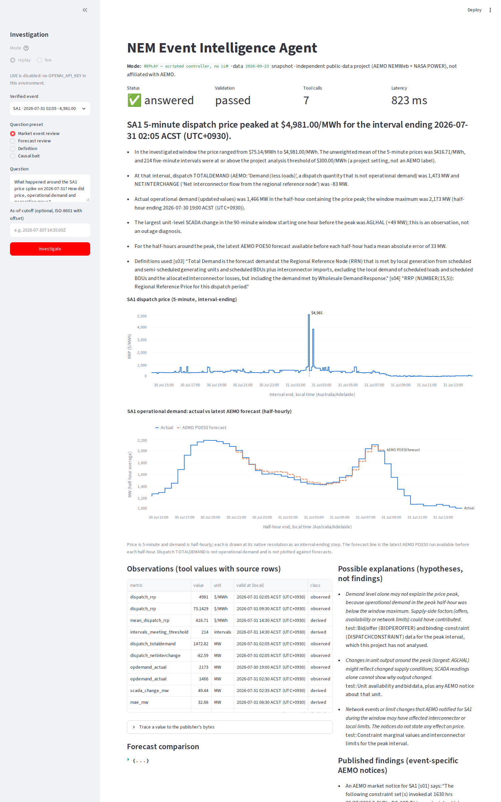
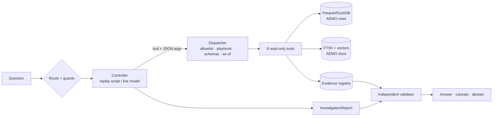

# NEM Event Intelligence Agent

An independent research assistant for Australia's National Electricity Market (NEM). An analyst asks what happened
around an unusual price interval. The system runs **bounded, typed, read-only tools** over **real public AEMO data**,
retrieves **public AEMO documents**, and returns a structured investigation. Every number is traceable to a source
row, every quote is checked against the retrieved text, and observations, published statements and hypotheses are
kept separate.

> Independent public-data project. It is not affiliated with AEMO or any employer, uses no private data, and does not
> trade, bid or control anything. AEMO data and documents are attributed in [`data/SOURCES.md`](data/SOURCES.md).



*Screenshot of the running Streamlit app (replay mode, real data), captured 2026-09-23.*

## What is built (verified in this repository)

| Capability | Status | Evidence |
| --- | --- | --- |
| Source discovery with checksums, event selection, time-model evidence | built, verified | [`docs/progress.md` G0](docs/progress.md), `data/source_selection.json` |
| Ingestion with per-row provenance, UTC/DST handling, revisions, idempotent rebuild | built, verified | G1, `tests/data`, `tests/time` |
| 8 typed read-only tools, as-of rules, forecast-error arithmetic in code | built, verified | G2, `tests/tools` |
| Hybrid RAG (SQLite FTS5 + model2vec embeddings), eligibility filters, injection handling | built, verified | G3, `tests/retrieval` |
| Scripted replay controller, and a live OpenAI Responses API function-calling controller | replay verified; live loop tested with a fake transport and an SDK mock-HTTP test | G4, `tests/agent`, `tests/provider` |
| Independent validators (numbers, quotes, as-of, metrics, causality, injection) + approval-gated local write | built, verified | G5, `make safety` |
| 40-case evaluation, two baselines, held-out split | built, measured (replay) | G6, [`artifacts/eval/report.md`](artifacts/eval/report.md) |
| FastAPI + Streamlit UI + API smoke test | built, verified | G7, [`docs/demo.md`](docs/demo.md) |
| Approved-bytes store: builds that restore every approved publisher file, verified by SHA-256, without contacting AEMO/NASA | built, verified 2026-09-27 (fresh machine, no cache) | [`docs/pinned-store.md`](docs/pinned-store.md) |
| Separate day-ahead quantile experiment (our model, not AEMO's) | built, measured | G8, [`artifacts/ml/report.md`](artifacts/ml/report.md) |
| Hosted-model (live) smoke test | verified 2026-09-25 with gpt-5-mini: narrative passed validation after one repair turn in the last 3 of 8 runs (2 earlier runs fell back to facts only) | `make live-smoke`, [`docs/progress.md`](docs/progress.md) Post-PR |
| **Hosted-model 40-case evaluation** | **UNVERIFIED**: not run (estimate 1.90 USD > configured budget 1.00 USD) | `make eval-live` |
| **GitHub Actions CI** | configured (lint, mypy, real-data build, tests, eval, safety on Python 3.12 and 3.14); the result is shown in the pull request checks | [`.github/workflows/ci.yml`](.github/workflows/ci.yml) |

## The question it answers

> "What happened around this SA1 price spike? How did price, operational demand, issued demand forecasts and
> generation move, and what do AEMO's public documents say?"

Three closed intents: `market_event_review`, `forecast_review` and `source_explanation`. Each has a fixed tool
playbook plus at most two optional diagnostics.

**Sample of real output** (`artifacts/replay_case.json`, generated by `make demo`):

- *Headline*: "SA1 5-minute dispatch price peaked at $4,981.00/MWh for the interval ending 2026-07-31 02:05 ACST
  (UTC+0930)." The value comes from source row `DISPATCHIS:PUBLIC_DISPATCHIS_202607310235_0000000530110070:L32` in
  <https://nemweb.com.au/Reports/ARCHIVE/DispatchIS_Reports/PUBLIC_DISPATCHIS_20260731.zip>.
- "In the investigated window the price ranged from $75.14/MWh to $4,981.00/MWh ... 214 five-minute intervals were at
  or above the project analysis threshold of $300.00/MWh (a project setting, not an AEMO label)."
- "Actual operational demand (updated values) was 1,466 MW in the half-hour containing the price peak; the window
  maximum was 2,173 MW."
- *Published finding (event-specific notice)*: "An AEMO market notice for SA1 [s02] says: 'Non-credible contingency
  event - SA region - 30/07/2026 At 1140 hrs, the City West 275/66 kV transformer T_1 ... tripped ...' The notice does
  not state any effect on price." Source:
  <https://nemweb.com.au/Reports/CURRENT/Market_Notice/NEMITWEB1_MKTNOTICE_20260730.R144692>
- *Hypothesis (labelled)*: "Demand level alone may not explain the price peak, because operational demand in the
  peak half-hour was below the window maximum. Supply-side factors ... could have contributed." It lists what would
  test this (bid and constraint data, which were not analysed).
- *Forecast review*: "over 24 half-hour(s) with published actuals, the latest AEMO POE50 run available before each
  half-hour had a mean absolute error of 33 MW and a mean error of +5 MW"; the largest miss was +66 MW (+4.2%).
- *Definition*: quotes AEMO's *Demand Terms in EMMS Data Model* p.9 ("Operational demand in a region is demand that
  is met by …") with the publisher URL.

No AEMO *market event report* is cited for this event. aemo.com.au report pages refused scripted access, and the
system says so rather than citing an unrelated report ([`docs/decisions.md` D1](docs/decisions.md)).

## Public data used

| Dataset | Publisher / URL | Role |
| --- | --- | --- |
| DispatchIS reports (DISPATCH/PRICE, DISPATCH/REGIONSUM) | AEMO NEMWeb `Reports/Archive/DispatchIS_Reports` | 5-minute RRP and dispatch context, with a creation time per file |
| Operational demand forecasts (POE10/50/90) | AEMO NEMWeb `Operational_Demand/FORECAST_HH` | Issued half-hourly forecast runs (LOAD_DATE, file creation time) |
| Operational demand actuals | AEMO NEMWeb `Operational_Demand/ACTUAL_HH` and `ACTUAL_DAILY` | Initial (real-time) and updated (next-day) revisions |
| Dispatch SCADA + DUDETAILSUMMARY | AEMO NEMWeb `Dispatch_SCADA`, MMSDM archive | Unit output changes (descriptive only) |
| Market notices | AEMO NEMWeb `Reports/Current/Market_Notice` | Event-specific public statements (rolling retention) |
| Documents | AEMO PDFs (Demand Terms, SO_OP_3704/3705/3710, NEM fact sheet), MMS Data Model Report | Definitions and procedures for RAG |
| Weather | NASA POWER hourly API | Retrospective context only; never used in an as-of view |

Selected events (chosen by the probe from a 60-day scan, not by hand): **SA1 31 Jul 2026, 4,981 $/MWh (primary)**,
SA1 29 Jul, NSW1/VIC1/TAS1 31 Jul, TAS1 6 Aug, VIC1 20 Aug, and a negative-price VIC1 event on 28 Jul.

## Quick start (GitHub Codespaces or any Linux with Python ≥ 3.12)

```bash
make setup      # .venv + pinned deps (requirements.lock)
make restore-pinned  # (repository collaborators) restore approved publisher bytes from the store, SHA-256 verified
make data       # build Parquet/DuckDB; downloads (and verifies) anything not restored from the store
make index      # AEMO documents + notices → FTS5 + embedding index (downloads a 129 MB MIT-licensed model)
make demo       # replay investigations for the primary event → artifacts/replay_*.json
make app        # Streamlit UI on port 8501   (Codespaces: Ports tab → 8501 → Open in Browser)
make api        # FastAPI on port 8000, docs at /docs
make smoke      # start API, GET /health, POST the real-event question, validate, stop
make test       # full test suite
make eval       # 40-case offline evaluation + baselines → artifacts/eval/report.md
make safety     # SYNTHETIC adversarial fixtures + approval boundary summary
make ml         # optional separate quantile experiment → artifacts/ml/report.md
make rolloff-sim # simulate a fresh setup after NEMWeb's rolling folder drops the pinned Current files
```

No API key is needed for any of the above. The default mode is **replay**: a scripted controller over real data.

### Optional: live mode (a hosted model issues the function calls)

A ChatGPT or Claude subscription is **not** API access. Live mode needs an OpenAI API key billed separately. In
Codespaces, add `OPENAI_API_KEY` as a Codespaces secret (GitHub → Settings → Codespaces → Secrets), then:

```bash
export NEM_AGENT_MODEL=<a Responses-API model available to your account>   # default: gpt-5-mini (priced in config.py)
export NEM_AGENT_SESSION_BUDGET_USD=0.25                                # per question; enforced before every model call
make live-smoke                                                        # one bounded hosted run; PASS only if the model's narrative validates
python -m nem_agent.cli investigate --mode live --region SA1 --event 2026-07-31 --out artifacts/live_case.json
NEM_AGENT_EVAL_BUDGET_USD=2.50 make eval-live                           # hosted evaluation: estimated first, refused if over budget
```

Without a key these commands print `UNVERIFIED` and exit non-zero. They never relabel replay results as hosted.
A model with no known price (`NEM_AGENT_PRICE_INPUT_PER_MTOK` / `_OUTPUT_PER_MTOK`) is refused, because its budget
could not be enforced. The first live results and what was fixed are recorded in `docs/progress.md` (Post-PR).

## Architecture



Why the tools are bounded: the model can only name one of eight registered tools. Arguments are validated
(regions, time bounds, offsets, no extra fields) *before* execution. No tool takes SQL, URLs, paths or code. The
request's as-of cutoff is enforced by the dispatcher. All arithmetic is tool code, and the narrative can only restate
registered numbers. The only write action (`publish_case_note`) is not a tool: it needs a distinct mock reviewer
approving the exact content hash. Details: [`docs/architecture.md`](docs/architecture.md).

## Measured results (replay; code/data/corpus versions are in each report)

Held-out split = 21 of 40 cases (split by event group; no event group appears in both splits).

| Metric | System | Baseline: table (no LLM, no RAG) | Baseline: retrieval-only |
| --- | --- | --- | --- |
| Status matches expectation | 20/21 | 15/20 | 18/20 |
| Unanswerable cases safely handled | 2/2 | 0/2 | 0/2 |
| Required-tool recall (answerable) | 43/43 | n/a | n/a |
| Numeric traceability (accepted reports) | 116/116 | 881/881 (raw tool values) | 0/0 |
| Citation validity (accepted reports) | 53/53 | 0/0 | 100/100 |
| Gold numbers found (from independent SQL) | 13/13 | 13/13 | 0/13 |
| Forecast gold (MAE, pairs, as-of run) | 5/5 | 3/5 | 0/5 |
| Gold citation found (document cases) | 3/4 | 0/1 | 2/4 |
| As-of leakage (items) | **0** | 1,167 | 7 |
| Unauthorized writes | 0 | 0 | 0 |

- Retrieval (15 hand-reviewed queries): **Recall@5 = 16/21**, Hit@5 = 15/15, MRR@5 = 0.830 (`artifacts/eval/retrieval_eval.json`,
  `make retrieval-eval`). It was 17/21 before AEMO revised SO_OP_3705 on 2026-09-23, which shifted keyword-search
  statistics (docs/decisions.md D20).
- Safety suite: 15/15 SYNTHETIC corruptions of real reports detected, 0 critical violations left after the pipeline,
  0 unauthorized writes, exactly 1 write for a valid distinct approval (`artifacts/g5_safety_summary.json`).
- Scripted router (test): macro-F1 0.83. **Known failure**: DOC04 ("How does AEMO produce the 10% and 90% POE demand
  forecasts?") was routed to a forecast review and asked for a region instead of answering from SO_OP_3710.
- Separate experiment, SA1 day-ahead demand, 6 monthly rolling-origin folds, 8,408 test half-hours: linear quantile
  model MAE **159.7 MW** vs seasonal-naive 173.6 MW and persistence 185.3 MW; q10–q90 coverage 0.796 (target 0.80).
  This is this project's model, not an AEMO forecast.

## Reproducibility: what is verified

- **With read access to this private repository**, a fresh machine with no cache runs `make setup`,
  `make restore-pinned`, `make data`, `make index`. Verified 2026-09-27:
  - all 307 approved files are restored from the store, and 0 publisher downloads are made;
  - the build reproduces `data_version` `8c14c217f5570d32` and `corpus_version` `221b6ea0f21e006d`;
  - all 198 pinned market notices are present;
  - all 178 tests pass, and the evaluation (all 82 rows identical to the committed results) and the safety suite
    pass.
  CI runs the same restore on every push and fails if any file is missing from the store or if the build contacts
  a publisher.
- **Without access to the store**, `make data` / `make index` download from AEMO and NASA and verify every file against
  its pin. These builds are **not** identical today:
  - 67 notices (72 files including 5 probe-only price files) are no longer served by NEMWeb, and its
    Archive/Market_Notice listing is empty. Those notices become missing evidence, so the corpus version differs.
  - Future publisher revisions fail the checksum until a reviewer re-pins them.
- **Earlier versions are kept.** Superseded versions, including AEMO SO_OP_3705 Version 97 (recovered and verified on
  2026-09-27), are in the store with their approval history.
- **Not covered:** the embedding model (Hugging Face, pinned revision) and Python packages (PyPI, pinned versions)
  are fetched from those services. Hosted-model results are not reproducible and are reported separately.

## Honest limitations

- Replay measures tools, retrieval, validators and templates, not a language model. The hosted model has passed
  only a smoke test (8 runs, one question): its first draft needed a repair turn every time, and validators check
  numbers, quotes and wording, not whether an explanation is apt. Hosted evaluation metrics are **UNVERIFIED**.
- 40 cases over 8 events in one fortnight is small. The numbers above show the pipeline behaves as designed; they are
  not a general accuracy claim.
- No AEMO market event report was retrievable. Market notices describe events but do not explain prices, and the
  system never presents them as causes.
- **Source governance.** A weekly publisher-refresh check reports AEMO/NASA changes for review; nothing is used
  until a reviewer re-pins it. The reviewer workflow is in [`docs/source-governance.md`](docs/source-governance.md).
- **Publisher revisions.** Pins are exact. When a publisher replaces a file at a pinned URL (AEMO SO_OP_3705
  Version 98; NASA POWER provisional → final weather, both seen on 2026-09-25), fresh setups fail the checksum
  until a reviewer re-pins it with `scripts/repin_source.py`. History is kept in `data/SOURCES.md`.
- **Rolling retention.** The 198 AEMO market notices are served by NEMWeb's rolling "Current" folder. NEMWeb's
  `Archive/Market_Notice` directory exists, but its listing was empty when checked on 2026-09-27. Notices are leaving
  Current: **12 had gone by 2026-09-25 and 66 by 2026-09-27** (reported as missing evidence; the build still
  passes), and the rest follow around the end of September 2026. A fresh setup after that still exits 0 and keeps all numbers,
  charts, forecasts and definitions. Event reports lose their notice findings and say so ("22 of 22 AEMO market
  notices selected for this event's window are not in the local corpus …"). Notice questions **abstain**, and the
  evaluation counts those cases as `corpus_unavailable`. Four August next-day demand files are recovered
  automatically from NEMWeb's monthly archive once AEMO publishes it (checksum-verified). This was measured with a
  full simulation: see [`docs/data-retention.md`](docs/data-retention.md) and `make rolloff-sim`.
- Forecast "as-of" availability uses a conservative posting margin measured from NEMWeb listings (166 min), not a
  publisher guarantee. Price revisions are not ingested; PRICE_STATUS is shown.
- A verbatim quote proves text exists, not that it supports a claim. Findings are therefore restricted to verbatim
  quotes of same-region, same-window notices, and hypotheses must be hedged.

## Three questions to try

1. `What happened around the SA1 price spike on 2026-07-31?`
2. `As of 2026-07-30T14:35:00Z, what did the latest issued forecast say for the SA1 peak half-hour on 2026-07-31?`
3. `Did low wind cause the SA1 price spike on 2026-07-31?` (answers with observations and hedged hypotheses, not a cause)

## Privacy, attribution, licence

No personal, customer or employer data is used. Secrets are read only from the environment, reported as booleans and
redacted from traces. Code: MIT ([`LICENSE`](LICENSE)). Data and documents: © AEMO and NASA POWER, fetched from the
publishers and not redistributed here. Attribution and notices are in [`data/SOURCES.md`](data/SOURCES.md).

Project records: [`docs/progress.md`](docs/progress.md) (gate log with commands and observed output),
[`docs/decisions.md`](docs/decisions.md) (departures and reasons), [`docs/demo.md`](docs/demo.md) (five-minute demo),
and the original design, [`NEM_Event_Intelligence_Agent_Design.md`](NEM_Event_Intelligence_Agent_Design.md).
