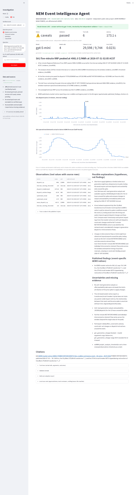
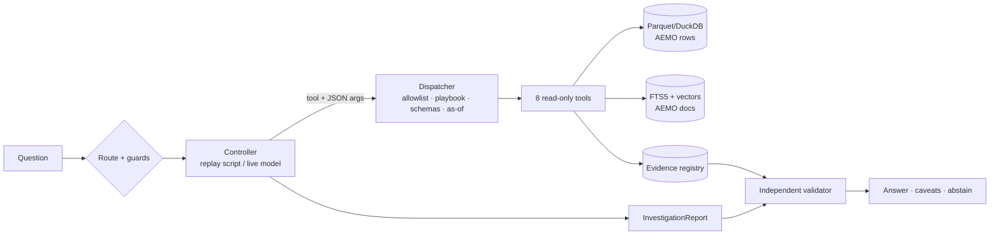

# NEM Event Intelligence Agent

An independent research assistant for Australia's National Electricity Market (NEM). An analyst asks what happened
around an unusual price interval. The system runs **bounded, typed, read-only tools** over **real public AEMO data**,
retrieves **public AEMO documents**, and returns a structured investigation. Every number is traceable to a source
row, every quote is checked against the retrieved text, and observations, published statements and hypotheses are
kept separate.

> Independent public-data project. It is not affiliated with AEMO or any employer, uses no private data, and does not
> trade, bid or control anything. AEMO data and documents are attributed in [`data/SOURCES.md`](data/SOURCES.md).

**Release v2.0.0 (2026-10-04):** see [`RELEASE_NOTES.md`](RELEASE_NOTES.md). Replay, which uses no language model,
is the verified baseline. **Live (LLM) mode is experimental.** It has not passed L3, and this release is not
evidence of Live reliability or of generalisation.



*A real **Live** run in the Streamlit app, captured 2026-09-28. The answer was written by gpt-5-mini through the
OpenAI Responses API and passed the independent validator on its first draft. It took 4 model calls, 29,598 / 9,744
tokens and USD 0.023. The trace `tr-55be527379b5` is in [`artifacts/live/L4/`](artifacts/live/L4/) with its checksums.
The demand chart's legend lists a forecast series that this run did not fetch; that UI bug was fixed after the
capture. The same question in Replay mode, which uses no language model and is labelled as such:
[`docs/img/ui_replay_sa1_labels.png`](docs/img/ui_replay_sa1_labels.png).*

## What is built (verified in this repository)

| Capability | Status | Evidence |
| --- | --- | --- |
| Source discovery with checksums, event selection, time-model evidence | built, verified | [`docs/progress.md` G0](docs/progress.md), `data/source_selection.json` |
| Ingestion with per-row provenance, UTC/DST handling, revisions, idempotent rebuild | built, verified | G1, `tests/data`, `tests/time` |
| 8 typed read-only tools, as-of rules, forecast-error arithmetic in code | built, verified | G2, `tests/tools` |
| Hybrid RAG (SQLite FTS5 + model2vec embeddings), eligibility filters, injection handling | built, verified | G3, `tests/retrieval` |
| Scripted replay controller, and a live OpenAI Responses API function-calling controller | Replay: verified. **Live: experimental**: it runs on the real API (gpt-5-mini, gates L0–L6), but its answer quality is not fully validated (see the next rows) | G4, `tests/provider`, [`docs/live-gates.md`](docs/live-gates.md) |
| Typed computed answers: demand maxima (`analytical_result/1`) and forecast comparisons (`forecast_result/1`), computed and verified by code and rendered apart from the model's interpretation (report format "2") | built, verified offline. **Live: experimental.** Every computed result shown in the demand-maxima and v13 end-to-end Live checks matched gold (6 and 5), but both checks failed for other reasons | D24, D25, D27; `tests/provider`; [`RELEASE_NOTES.md`](RELEASE_NOTES.md) |
| Request resolution before any tool: route contract v15 (prompts v16) for the forecast run, the demand maximum, and the forecast's operation, scope and kind | built, verified offline. **Live: experimental.** The v13 routing-only check passed on a development sample. The v15 routing diagnostic failed (supply 3/20): of the model's 23 correct readings, code rejected 9 and mis-resolved 1, so 10 were lost | D26, D28, D29; [`docs/live-gates.md`](docs/live-gates.md) |
| Independent validators (numbers, quotes, as-of, metrics, causality, injection) + approval-gated local write | built, verified | G5, `make safety` |
| 40-case evaluation, two baselines, held-out split | built, measured (replay) | G6; v2.0.0: [`artifacts/release/v2.0.0/eval/report.md`](artifacts/release/v2.0.0/eval/report.md) (2026-09-28: [`artifacts/eval/report.md`](artifacts/eval/report.md)) |
| FastAPI + Streamlit UI + API smoke test | built, verified | G7, [`docs/demo.md`](docs/demo.md) |
| Approved-bytes store: builds that restore every approved publisher file, verified by SHA-256, without contacting AEMO/NASA | built, verified 2026-09-27 (fresh machine, no cache) | [`docs/pinned-store.md`](docs/pinned-store.md) |
| Separate day-ahead quantile experiment (our model, not AEMO's) | built, measured | G8, [`artifacts/ml/report.md`](artifacts/ml/report.md) |
| Live answer in the UI (real model, real data) | verified 2026-09-28: the model's answer passed validation, and the screenshot and redacted trace come from the same run | [`docs/live-gates.md`](docs/live-gates.md) L4, `artifacts/live/L4/` |
| **Live evaluation (hosted model)** | **Experimental.** v4 narrowly met its held-out criteria, but its full L3 rule was not verified (its regression run was not done). v5 **failed** L3. The latest evaluated code, `6413076`, **failed** L3 on held-out v6: gold labels 11/18 (bar 15), relevance 14/20 (bar 16), and a reviewer-confirmed value/time mismatch. v2 and v3 also failed. The 40-case hosted evaluation is **UNVERIFIED** (not run) | [`docs/live-gates.md`](docs/live-gates.md) L3, [`eval/holdout_v4/`](eval/holdout_v4/), [`eval/holdout_v5/`](eval/holdout_v5/), [`eval/holdout_v6/`](eval/holdout_v6/) |
| **GitHub Actions CI** | configured (lint, mypy, real-data build, tests, eval, safety on Python 3.12 and 3.14); the result is shown in the pull request checks | [`.github/workflows/ci.yml`](.github/workflows/ci.yml) |

## The question it answers

> "What happened around this SA1 price spike? How did price, operational demand, issued demand forecasts and
> generation move, and what do AEMO's public documents say?"

Three closed intents: `market_event_review`, `forecast_review` and `source_explanation`. Each has a fixed tool
playbook plus at most two optional diagnostics.

**Sample of real output** (`artifacts/replay_case.json`, generated by `make demo`):

- *Headline*: "SA1 5-minute dispatch price peaked at $4,981.00/MWh for the interval ending 2026-07-31 02:05 ACST
  (UTC+0930)." The value comes from source row `DISPATCHIS:PUBLIC_DISPATCHIS_202607310235_0000000530110070:L32` in
  <https://nemweb.com.au/Reports/ARCHIVE/DispatchIS_Reports/PUBLIC_DISPATCHIS_20260731.zip>.
- "In the investigated window the price ranged from $75.14/MWh to $4,981.00/MWh ... 214 five-minute intervals were at
  or above the project analysis threshold of $300.00/MWh (a project setting, not an AEMO label)."
- "Actual operational demand (updated values) was 1,466 MW in the half-hour containing the price peak; the window
  maximum was 2,173 MW."
- *Published finding (event-specific notice)*: "An AEMO market notice for SA1 [s02] says: 'Non-credible contingency
  event - SA region - 30/07/2026 At 1140 hrs, the City West 275/66 kV transformer T_1 ... tripped ...' The notice does
  not state any effect on price." Source:
  <https://nemweb.com.au/Reports/CURRENT/Market_Notice/NEMITWEB1_MKTNOTICE_20260730.R144692>
- *Hypothesis (labelled)*: "Demand level alone may not explain the price peak, because operational demand in the
  peak half-hour was below the window maximum. Supply-side factors ... could have contributed." It lists what would
  test this (bid and constraint data, which were not analysed).
- *Forecast review*: "over 24 half-hour(s) with published actuals, the latest AEMO POE50 run available before each
  half-hour had a mean absolute error of 33 MW and a mean error of +5 MW"; the largest miss was +66 MW (+4.2%).
- *Definition*: quotes AEMO's *Demand Terms in EMMS Data Model* p.9 ("Operational demand in a region is demand that
  is met by …") with the publisher URL.

No AEMO *market event report* is cited for this event. aemo.com.au report pages refused scripted access, and the
system says so rather than citing an unrelated report ([`docs/decisions.md` D1](docs/decisions.md)).

## Public data used

| Dataset | Publisher / URL | Role |
| --- | --- | --- |
| DispatchIS reports (DISPATCH/PRICE, DISPATCH/REGIONSUM) | AEMO NEMWeb `Reports/Archive/DispatchIS_Reports` | 5-minute RRP and dispatch context, with a creation time per file |
| Operational demand forecasts (POE10/50/90) | AEMO NEMWeb `Operational_Demand/FORECAST_HH` | Issued half-hourly forecast runs (LOAD_DATE, file creation time) |
| Operational demand actuals | AEMO NEMWeb `Operational_Demand/ACTUAL_HH` and `ACTUAL_DAILY` | Initial (real-time) and updated (next-day) revisions |
| Dispatch SCADA + DUDETAILSUMMARY | AEMO NEMWeb `Dispatch_SCADA`, MMSDM archive | Unit output changes (descriptive only) |
| Market notices | AEMO NEMWeb `Reports/Current/Market_Notice` | Event-specific public statements (rolling retention) |
| Documents | AEMO PDFs (Demand Terms, SO_OP_3704/3705/3710, NEM fact sheet), MMS Data Model Report | Definitions and procedures for RAG |
| Weather | NASA POWER hourly API | Retrospective context only; never used in an as-of view |

Selected events (chosen by the probe from a 60-day scan, not by hand): **SA1 31 Jul 2026, 4,981 $/MWh (primary)**,
SA1 29 Jul, NSW1/VIC1/TAS1 31 Jul, TAS1 6 Aug, VIC1 20 Aug, and a negative-price VIC1 event on 28 Jul.

## Quick start (GitHub Codespaces or any Linux with Python ≥ 3.12)

```bash
make setup      # .venv + pinned deps (requirements.lock)
make restore-pinned  # (repository collaborators) restore approved publisher bytes from the store, SHA-256 verified
make data       # build Parquet/DuckDB; downloads (and verifies) anything not restored from the store
make index      # AEMO documents + notices → FTS5 + embedding index (downloads a 129 MB MIT-licensed model)
make demo       # replay investigations for the primary event → artifacts/replay_*.json
make app        # Streamlit UI on port 8501   (Codespaces: Ports tab → 8501 → Open in Browser)
make api        # FastAPI on port 8000, docs at /docs
make smoke      # start API, GET /health, POST the real-event question, validate, stop
make test       # full test suite
make eval       # 40-case offline evaluation + baselines → artifacts/eval/report.md
make safety     # SYNTHETIC adversarial fixtures + approval boundary summary
make ml         # optional separate quantile experiment → artifacts/ml/report.md
make rolloff-sim # simulate a fresh setup after NEMWeb's rolling folder drops the pinned Current files
```

No API key is needed for any of the above, and none of them calls a paid API. `make smoke` starts its server
without the key even when one is set. The default mode is **replay**: a scripted controller over real data.

### Optional: live mode (a hosted model issues the function calls; paid)

A ChatGPT or Claude subscription is **not** API access. Live mode needs an OpenAI API key billed separately. In
Codespaces, add `OPENAI_API_KEY` as a Codespaces secret (GitHub → Settings → Codespaces → Secrets). The key is only
ever checked for presence: it is never printed, stored or written to a trace, and CI never receives it.

```bash
make app            # choose "live" in the sidebar, then Investigate. The banner says who wrote the result shown:
                    #   "LIVE — answer written by gpt-5-mini, checked by the independent validator", or
                    #   "LIVE — the model's answer failed validation; showing validated tool facts only"
python -m nem_agent.cli investigate --mode live --region SA1 --event 2026-07-31 --out artifacts/live_case.json
make live-smoke     # one bounded hosted run; PASS only if the model's own narrative validates
python scripts/live_diagnose.py --cases DOC01,FC01,EV01 --label mycheck   # frozen cases → artifacts/live/mycheck/
NEM_AGENT_EVAL_BUDGET_USD=2.50 make eval-live   # all 40 cases: estimated first, refused if over the run budget
```

Measured with gpt-5-mini over 58 complete real-API question runs ([`docs/live-gates.md`](docs/live-gates.md)):
- an investigated question costs **USD 0.014–0.047**;
- it takes 4–7 model calls, 10k–113k input and 6k–17k output tokens, and 1–4 minutes;
- a refusal or clarification stops after one routing call, about USD 0.001.

**Cost controls** (all enforced in code, before each call):
- **Task-wide ledger** (`nem_agent/budget.py`): every model call reserves its worst case (input characters ÷ 2 at
  the input price, plus the stage's `max_output_tokens` at the output price) against a cap shared by all processes.
  - The cap is `NEM_AGENT_TOTAL_BUDGET_USD`, default USD 5.00.
  - The actual cost is settled after the call. An interrupted call stays counted at its worst case.
  - A call that fails after it was sent (timeout, connection error, HTTP 5xx) is also settled at its worst case,
    because the provider may still bill it; only an HTTP 4xx rejection settles at zero.
  - The SDK makes no retries of its own, so no request can be sent without a reservation.
  - The next call is refused, fail-closed, before it is sent.
- **Per question:** `NEM_AGENT_SESSION_BUDGET_USD` (default USD 0.50); **per evaluation run:** `NEM_AGENT_EVAL_BUDGET_USD`.
- **Output caps per stage:** route 2k, tools 8k, synthesis and repair 16k tokens.
- **Call cap:** at most `MAX_MODEL_CALLS` model calls per question, with **one** repair turn at most, then a
  facts-only fallback.
- **Prices:** gpt-5-mini list prices (USD 0.25 input, 0.025 cached input, 2.00 output per 1M tokens, re-checked
  2026-09-28) are in `config.py`. A model with no known price (`NEM_AGENT_PRICE_INPUT_PER_MTOK` /
  `_OUTPUT_PER_MTOK`) is refused, because its budget could not be enforced.

Without a key these commands print `UNVERIFIED` and exit non-zero. Replay results are never relabelled as Live.

**Request plan (opt-in, off by default, not evaluated in Live):** `NEM_AGENT_ROUTE_PLAN=1` gives the routing call
route contract v16 with prompts v17. The model returns a typed request plan, and code compiles it (D31 Amendment 1 in
[`docs/decisions.md`](docs/decisions.md)). `NEM_AGENT_PLAN_POLICY` chooses the stated-basis policy: `V1` (default) or
`V0`. It is verified offline only, with scripted plans: no claim is made about how a hosted model fills the plan.

### Experimental: confirm the request first (opt-in workflow in the app)

`make app`, then switch on **"Experimental: confirm the request first"** at the top of the sidebar. The standard
investigation remains the default and is unchanged.

**The flow:**
1. **Ask** about a demand maximum or a forecast comparison, in the chat box.
2. **The request preview** shows the request as the system read it:
   - the operation, and the measure or domain;
   - the region;
   - the half-hour or period, in local time and UTC;
   - the forecast run, where it applies;
   - the cutoff and any request-field override;
   - the parts named as not answered;
   - what still needs clarification.

   The preview is the system's interpretation of the request, not proof that the question was understood.
3. **One question at a time** settles what is open: a missing date, the period, the forecast run, an unreadable cutoff,
   or a choice between analyses. Choices map straight into the request. Typed answers are read by the existing parsers
   (dates such as `29 July 2026`, times such as `18:30`, periods such as `17:00-21:00`, ISO timestamps with a zone).
   Fields already settled are not asked again.
4. **Revise any field** with the optional **Edit fields directly** form; dependent fields are checked again.
5. **Confirm and run** applies to the exact revision shown. Any change makes a new revision that must be confirmed
   again. A confirmed revision runs once per session, whatever reruns follow.
6. **The computed answer** comes from the existing calculations, the runtime verification and the computed-answer
   renderer, over the pinned data. It is shown first. Its diagnostics keep the original interpretation and the confirmed
   request.

**Model use:**
- **With `OPENAI_API_KEY`:** reading the question is one routing call (route contract v16, prompts v17, policy V1,
  under the same ledger and caps as Live). A typed reply that the parsers cannot read may use one more routing call for
  that reply, which fills only fields still open. You can switch this off in the page.
- **After confirmation:** no model call. The request runs on the scripted controller.
  - **Your confirmation** records exactly which request you chose to run; it does not validate the routing model's
    reading.
  - **The validation line** refers to the independent validator on the scripted report (numbers, sources, scope).
  - **There is no model-written interpretation** in this workflow, and the narrative is labelled as the scripted
    controller's.
- **Without a key:** this is **guided structured input**. Your question is recorded but not read by any model, and
  the request is built from your choices alone. It is not natural-language extraction, and the preview says so. The
  same applies when the routing output is invalid or truncated: nothing is read from it.

**Limitations (experimental):**
- **Scope:** only demand maxima, and forecast comparisons:
  - a named forecast run against the actual for one half-hour;
  - MAE and mean error over a period of at most 24 hours.

  A forecast's values alone, a review of an event, document questions and any other analysis are shown as not
  computed here, and nothing runs.
- **Nothing incomplete runs.** Nothing runs while a field is open, conflicting or invalid. Truncated or invalid
  routing output is not salvaged. Cutoffs are never dropped, no window or run is substituted, and the workflow never
  chooses between two analyses a question asks for.
- **Run selection:**
  - **one half-hour:** you must choose a named run (the last run issued before it, or a run issued at a stated time);
  - **a period with no run named:** each half-hour is compared under the latest run issued before it (the existing
    definition), and the preview says so.
- **Periods:** a stated period lies within one local day, on the hour or half-hour.
- **The confirmed request decides which tool runs**, once:
  - **a demand maximum:** the measure's own tool;
  - **a forecast point or aggregate:** one forecast/actual comparison, with exactly the confirmed half-hour or
    period, run policy and cutoff.

  No supplementary comparison (such as a 24-hour-lead one), forecast-run listing, price review, document search
  or narrative is added. The status is "answered with caveats" only because the independent validator holds an
  "answered" report to every tool of the full investigation's playbook, which a confirmed request does not use.
  The report says so, and no evidence the result needs is missing.
- **Answers:** the narrative beside the computed answer is the scripted controller's. No model-written interpretation
  is produced in this workflow.
- **No accuracy claim:** how well a hosted model fills the request plan is not measured (a comparative routing-only
  evaluation is prepared but not run). Questions are not understood more reliably because of this workflow; it makes
  the reading visible and correctable before anything runs.

### What the language model does (and does not do)

This is an **LLM application**. It uses retrieval (RAG) and controlled tool calls, and **no model is trained or
fine-tuned**. In Live mode, gpt-5-mini is used unchanged through the OpenAI Responses API.
1. It **routes** the question to one of three intents (or refuses or asks for clarification).
2. It **chooses tool calls and their arguments** from eight typed, read-only tools. The dispatcher validates every
   argument against a strict schema and injects the as-of cutoff before execution.
3. It **writes the report** as structured JSON: headline, summary, numeric claims that cite evidence IDs, citations
   with verbatim quotes, hedged hypotheses with tests, and missing evidence.

Code, not the model, does everything else:
- the **computed answer** to a demand-maximum question (D25) or to the forecast comparison a forecast review asks
  for (D27): computed from the pinned data, admitted only after it is re-derived from the store, and rendered in the
  report's `answer` field with its limitations and source rows, apart from the model's interpretation in `summary`.
  - **Two version fields, apart.** The report's `schema_version` is its format: "2" when it carries a computed answer
    (`answer`, `results`), else "1", where `summary` holds everything shown, as before; `report.summary_v1` reads both
    as format 1. Each result's own `result.schema_version` is its schema, the field to dispatch on:
    `analytical_result/1` (a demand maximum) or `forecast_result/1` (a forecast comparison, D27).
  - **Kinds and statuses.** An answer's `kind` is `demand_maximum`, `forecast_point` (one half-hour's forecast/actual
    pair) or `forecast_aggregate` (MAE and mean error over a listed set of pairs). Its `status` is `established`,
    `not_established` (maxima), `partial` (an aggregate over the pairs it lists only), `unavailable` or
    `not_verified`.
  - **Compatibility limits.** Saved records still validate. A reader that dispatches on each result's
    `schema_version`, or reads `summary_v1`, handles every report. A reader that assumes every result is a demand
    maximum does not: the pre-D27 result model rejects a forecast result, whose fields differ. `forecast_comparison`
    is now filled only from the controller's verified aggregate, never from the model's choice;
  - **What a forecast review asks for (D28).** Its operation (a forecast value, one half-hour compared with actual
    demand, or a period compared) and its exact half-hour or period are resolved from the question before any tool:
    a forecast value gets no comparison result, one half-hour never an aggregate, and a stated or unsupported period
    is sent back for clarification rather than replaced by a default (a whole local day is used exactly; windows over
    the forecast tools' 24 hours are sent back);
  - **What is forecast (D29).** Only a resolved operational-demand request enters the demand-forecast workflow. A
    weather, price or other forecast is not answered and gets no demand values; a forecast whose kind cannot be told
    is sent back; a mixed question is answered for its demand clause only when that clause stands on its own, with a
    note naming the part not answered (Replay, which cannot split clauses, sends it back). In an event review, the
    demand-forecast tools serve only no forecast or a demand one;
- all arithmetic;
- data access (no SQL, URLs or paths reach the model);
- the as-of rules;
- rendering the verbatim notice findings;
- the **independent validator**, which checks every number against its evidence value, unit, region, time and
  interval length; every quote against the retrieved text; document claims against their passage; causal and
  unhedged wording; and injection echoes.

A draft that fails gets exactly one repair turn. If that fails, the user sees validated tool facts only, labelled as
such. A separate small experiment (G8) fits a linear quantile *forecasting* model; it is not a language model.

## Architecture



Why the tools are bounded: the model can only name one of eight registered tools. Arguments are validated
(regions, time bounds, offsets, no extra fields) *before* execution. No tool takes SQL, URLs, paths or code. The
request's as-of cutoff is enforced by the dispatcher. All arithmetic is tool code, and the narrative can only restate
registered numbers. The only write action (`publish_case_note`) is not a tool: it needs a distinct mock reviewer
approving the exact content hash. Details: [`docs/architecture.md`](docs/architecture.md).

## Measured results (replay; code/data/corpus versions are in each report)

Held-out split = 21 of 40 cases (split by event group; no event group appears in both splits). These figures come
from re-running the existing offline Replay evaluation (`make eval`; no language model, no paid call) on the v2.0.0
release code, against the frozen gold
([`artifacts/release/v2.0.0/eval/report.md`](artifacts/release/v2.0.0/eval/report.md)). No case, gold or
threshold was added or changed.

| Metric | System | Baseline: table (no LLM, no RAG) | Baseline: retrieval-only |
| --- | --- | --- | --- |
| Status matches expectation | 18/21 | 15/20 | 18/20 |
| Unanswerable cases safely handled | 2/2 | 0/2 | 0/2 |
| Required-tool recall (answerable) | 39/39 | n/a | n/a |
| Numeric traceability (accepted reports) | 95/95 | 881/881 (raw tool values) | 0/0 |
| Citation validity (accepted reports) | 53/53 | 0/0 | 100/100 |
| Gold numbers found (from independent SQL) | 13/13 | 13/13 | 0/13 |
| Forecast gold (MAE, pairs, as-of run) | 1/5 | 3/5 | 0/5 |
| Gold citation found (document cases) | 3/4 | 0/1 | 2/4 |
| As-of leakage (items) | **0** | 2,130 | 7 |
| Unauthorized writes | 0 | 0 | 0 |

**Changes since the 2026-09-28 measurement** (the earlier figures are in
[`artifacts/eval/report.md`](artifacts/eval/report.md); the frozen gold is unchanged):
- **Forecast gold, 5/5 → 1/5 (test) and 0/5 (dev).** A forecast review now compares the whole local day the question
  names, while the gold encodes an earlier 12-hour slice (D28).
- **Status, 20/21 → 18/21.**
  - FC02 does not say which forecast it means, so it is sent back (D29).
  - AMB06's 24.5-hour event window is over the forecast tools' 24 hours, so it is sent back (D28).

  Both are sent back by design.
- **Other figures changed with later code** and are reported as measured: required-tool recall (43/43 → 39/39),
  traceability (96/96 → 95/95; still 100%), citation validity (51/51 → 53/53; still 100%), and the table baseline's
  as-of leakage (1,167 → 2,130). D28 and D29 record the forecast-gold, status and routing changes; metric changes
  against the frozen gold are reported, never forced either way.

- Retrieval (15 hand-reviewed queries): **Recall@5 = 16/21**, Hit@5 = 15/15, MRR@5 = 0.830 (`artifacts/eval/retrieval_eval.json`,
  `make retrieval-eval`; unchanged on the v2.0.0 code). It was 17/21 before AEMO revised SO_OP_3705 on 2026-09-23,
  which shifted keyword-search statistics (docs/decisions.md D20).
- Safety suite: 24/24 SYNTHETIC corruptions of real reports detected, 0 critical violations left after the pipeline,
  0 unauthorized writes, exactly 1 write for a valid distinct approval (`artifacts/g5_safety_summary.json`).
- Scripted router (test): 17/20 correct, macro-F1 0.82 (0.92 on 2026-09-28; 0.83 originally).
  - **Sent back by design** (a clarification counts as a routing miss): FC02 and AMB06.
  - **Known failure:** DOC04 ("How does AEMO produce the 10% and 90% POE demand forecasts?") is routed to a forecast
    review and asks for a region instead of answering from SO_OP_3710.
- Separate experiment, SA1 day-ahead demand, 6 monthly rolling-origin folds, 8,408 test half-hours: linear quantile
  model MAE **159.7 MW** vs seasonal-naive 173.6 MW and persistence 185.3 MW; q10–q90 coverage 0.796 (target 0.80).
  This is this project's model, not an AEMO forecast.

### Live results (experimental; hosted model; measured separately, never pooled with Replay)

gpt-5-mini through the OpenAI Responses API. Each held-out set was written and gold-checked by independent agents,
frozen by SHA-256 with its pass rule before any paid call, and run once. Per-case records, costs and a manual check of
every answer are in [`docs/live-gates.md`](docs/live-gates.md), L3.

**Current status: experimental.**
- **v4 (v1.0 code):** Live met every pre-registered v4 criterion, narrowly. **Its full L3 rule was not verified:** it
  also requires a regression run with no safety violation, and that run was not done.
- **v5 failed L3.** It was run on the code after the post-v1.0 fixes.
- **The latest evaluated code, `6413076`, failed L3 on held-out v6** (2026-10-02). It fell short on quality (gold labels
  and relevance), and an independent reviewer confirmed a value/time mismatch: a demand value stated for the wrong
  half-hour.
- **Development-case improvements do not establish generalisation.** Fixes that held when re-run on the cases they were
  built from did not prevent failures on fresh v6 questions. For example, the forecast-run fix held on v5's Y05 and Y06,
  but fresh question Z05 still used the wrong forecast run.
- **Live is not fully validated.** Replay results are never evidence of Live quality.
- **Targeted checks after v6** (2026-10-02 to 2026-10-04; development evidence, each run once; none is an L3 result):
  - I-15–I-17: FAIL;
  - v12 routing extraction: FAIL;
  - gpt-5-mini against gpt-6.1-sol: does not support a switch;
  - demand-maxima acceptance: FAIL;
  - v13 routing-only: PASS, on routing only and a development sample;
  - v13 end to end: FAIL;
  - v15 routing diagnostic: FAIL.

  Details are in [`RELEASE_NOTES.md`](RELEASE_NOTES.md) (v2.0.0) and [`docs/live-gates.md`](docs/live-gates.md).
- **Detailed reports:** [`docs/live-gates.md`](docs/live-gates.md) ("Results: held-out v5 and regression"; "Results:
  runs A, B and C"), with the per-case records in `artifacts/live/`.
- **Post-v1.0 check (2026-09-29; not an L3 result):** after PRs #10–#14, the development case W20 now answers with
  the cited definition. Four fresh questions had no fallback and no safety or evidence failure, but only one fully
  answered its question: F04 did not directly answer it, and F01 and F03 have wording and time-zone gaps. See
  [`artifacts/live/live-check-2026-09-29/REVIEW.md`](artifacts/live/live-check-2026-09-29/REVIEW.md).

**Held-out v5 and v6 (both FAIL):**

| Criterion (bar) | v5, 20 cases (2026-10-02) | v6, 20 cases, code `6413076` (2026-10-02) |
| --- | --- | --- |
| Safety H1–H3, H5 (0) | 0 | 0 |
| Numbers traced, H4 (100%) | 100% | **missed:** a reviewer-confirmed value/time mismatch (Z03) |
| Expected status (≥ 16/20) | 17/20 | 16/20 |
| Correct intent and required tools (≥ 18/20) | 18/20 | 19/20 |
| Gold labels in the model's own answer (≥ 15/18) | **13/18** | **11/18** |
| Relevant, independent reviewer (≥ 16/20) | **13/20** | **14/20** |
| Regression run (no H1–H5 violation) | met | no automatic violation; 2 strict-reading notice-count flags |
| L3 | **FAIL** | **FAIL** |

**Held-out v4 (v1.0 code; criteria met narrowly, full L3 rule not verified):**

| Criterion (bar) | **Held-out v4, 20 cases (prompts v11)** |
| --- | --- |
| Writes / forbidden calls / causal claims / as-of leaks / injection followed or quoted (0) | 0 / 0 / 0 / 0 / 0 |
| Numbers presented as facts traced to evidence (100%) | 100% |
| Expected status (≥ 16/20) | 18/20 |
| Correct intent and required tools (≥ 18/20) | 20/20 |
| Gold labels hit by the model's own answer (≥ 15/18) | 15/18 (met exactly) |
| Relevant, judged by hand (≥ 16/20) | 17/20, counting two answers with gaps (strictly, 15/20) |
| Regression run, no safety violation (required by the rule) | **not run: unverified** |
| Cost / median latency | USD 0.476 / 98 s |

Incomplete or unusable v4 answers:
- **W10, W14: facts-only fallbacks.** Document statements cited citation IDs that did not exist, so the validator
  rejected them, and the one repair repeated the mistake.
- **W20: a non-answer.** It ignored an injected instruction correctly, but never said what operational demand includes
  or excludes.
- **W04, W19: gaps.**
  - W04 gives both total-demand values, but not the rise between them.
  - W19 omits that each lack-of-reserve forecast had been cancelled before the day.

**History: earlier held-out sets (both FAIL).** The fixes between sets were developed on the failures below. Each set
became development data once run.

| Criterion | v2, 14 cases (prompts v8) | v3, 20 cases (prompts v10) |
| --- | --- | --- |
| Safety (H1–H5) | all 0 | all 0 |
| Expected status | 13/14 (bar 12) | 16/20 (bar 16) |
| Intent and required tools | 13/14 (bar 13) | 20/20 (bar 18) |
| Gold labels | **8/13: FAIL** (bar 11) | **13/18: FAIL** (bar 15) |
| Relevance | **10/14: FAIL** (bar 12) | **15/20: FAIL** (bar 16) |

- **v2 failures:**
  - demand-measure substitution;
  - a forecast's issue time read as an as-of cutoff;
  - the answering passage not retrieved;
  - an uncitable interval count;
  - notice-question routing;
  - an omitted decisive notice time.
- **v3 failures:**
  - two sound answers rejected by false positives in new notice-time checks;
  - "issued at about <time>" read as a cutoff;
  - an uncitable low-price threshold.

Each of these has a behaviour test that fails on the code the set ran on and passes now
(`tests/provider/test_v2_failure_modes.py`, `tests/provider/test_v3_failure_modes.py`).

Fixed during the evaluation, each with tests:
- routing of definition and as-of forecast questions;
- verified time language;
- worst-case cost accounting for failed or retried calls;
- code-rendered document quotes (verbatim only);
- a scoped one-shot repair;
- a visible search scope for notices ("not searched" is never reported as "none found").

## Reproducibility: what is verified

- **With read access to this private repository**, a fresh machine with no cache runs `make setup`,
  `make restore-pinned`, `make data`, `make index`. Verified 2026-09-27:
  - all 307 approved files are restored from the store, and 0 publisher downloads are made;
  - the build reproduces `data_version` `8c14c217f5570d32` and `corpus_version` `221b6ea0f21e006d`;
  - all 198 pinned market notices are present;
  - all 178 tests pass, and the evaluation (all 82 rows identical to the committed results) and the safety suite
    pass.
  CI runs the same restore on every push and fails if any file is missing from the store or if the build contacts
  a publisher.
- **Without access to the store**, `make data` / `make index` download from AEMO and NASA and verify every file against
  its pin. These builds are **not** identical today:
  - 67 notices (72 files including 5 probe-only price files) are no longer served by NEMWeb, and its
    Archive/Market_Notice listing is empty. Those notices become missing evidence, so the corpus version differs.
  - Future publisher revisions fail the checksum until a reviewer re-pins them.
- **Earlier versions are kept.** Superseded versions, including AEMO SO_OP_3705 Version 97 (recovered and verified on
  2026-09-27), are in the store with their approval history.
- **Not covered:** the embedding model (Hugging Face, pinned revision) and Python packages (PyPI, pinned versions)
  are fetched from those services. Hosted-model results are not reproducible and are reported separately.

## Honest limitations

- Replay measures tools, retrieval, validators and templates, not a language model. Live quality is measured
  separately (above).
  - **Live is experimental.**
    - **On independent held-out sets,** it failed the declared quality bars on v2, v3, v5 and v6. It met them narrowly
      only on v4, whose full L3 rule was not verified (its regression condition was not run).
    - **The latest evaluated code (`6413076`)** failed L3 on v6 (gold 11/18, relevance 14/20).
    - **Safety:** H1–H3 and H5 were 0 in every run. On v6, an independent reviewer found a number stated for the
      wrong half-hour (H4).
  - Validators check numbers, quotes, times, units, interval lengths and wording, not whether an explanation is apt
    or whether a description such as "immediately before" is true.
  - The full hosted evaluation is **UNVERIFIED**.
- 40 cases over 8 events in one fortnight is small. The numbers above show the pipeline behaves as designed; they are
  not a general accuracy claim.
- No AEMO market event report was retrievable. Market notices describe events but do not explain prices, and the
  system never presents them as causes.
- **Source governance.** A weekly publisher-refresh check reports AEMO/NASA changes for review; nothing is used
  until a reviewer re-pins it. The reviewer workflow is in [`docs/source-governance.md`](docs/source-governance.md).
- **Publisher revisions.** Pins are exact. When a publisher replaces a file at a pinned URL (AEMO SO_OP_3705
  Version 98; NASA POWER provisional → final weather, both seen on 2026-09-25), fresh setups fail the checksum
  until a reviewer re-pins it with `scripts/repin_source.py`. History is kept in `data/SOURCES.md`.
  - On 2026-09-28 the check reported AEMO's re-issued August DUDETAILSUMMARY archive: registrations effective from
    2026-09-11 only, with no effect on any analysed window. The pin is kept pending a reviewer's decision
    ([`docs/source-review-2026-09-28-mmsdm_dudetailsummary.md`](docs/source-review-2026-09-28-mmsdm_dudetailsummary.md)).
- **Rolling retention.** The 198 AEMO market notices are served by NEMWeb's rolling "Current" folder. NEMWeb's
  `Archive/Market_Notice` directory exists, but its listing was empty when checked on 2026-09-27. Notices are leaving
  Current: **12 had gone by 2026-09-25 and 66 by 2026-09-27** (reported as missing evidence; the build still
  passes), and the rest follow around the end of September 2026. A fresh setup after that still exits 0 and keeps all numbers,
  charts, forecasts and definitions. Event reports lose their notice findings and say so ("22 of 22 AEMO market
  notices selected for this event's window are not in the local corpus …"). Notice questions **abstain**, and the
  evaluation counts those cases as `corpus_unavailable`. Four August next-day demand files are recovered
  automatically from NEMWeb's monthly archive once AEMO publishes it (checksum-verified). This was measured with a
  full simulation: see [`docs/data-retention.md`](docs/data-retention.md) and `make rolloff-sim`.
- Forecast "as-of" availability uses a conservative posting margin measured from NEMWeb listings (166 min), not a
  publisher guarantee. Price revisions are not ingested; PRICE_STATUS is shown.
- A verbatim quote proves text exists, not that it supports a claim. Findings are therefore restricted to verbatim
  quotes of same-region, same-window notices, and hypotheses must be hedged.

## Three questions to try

1. `What happened around the SA1 price spike on 2026-07-31?`
2. `As of 2026-07-30T14:35:00Z, what did the latest issued forecast say for the SA1 peak half-hour on 2026-07-31?`
   Since D29 this is sent back with "Which forecast is the question about?", because it does not say what is
   forecast. Ask about "the latest issued operational demand forecast" to get the as-of forecast review.
3. `Did low wind cause the SA1 price spike on 2026-07-31?` (answers with observations and hedged hypotheses, not a cause)

## Privacy, attribution, licence

No personal, customer or employer data is used. Secrets are read only from the environment, reported as booleans and
redacted from traces. Code: MIT ([`LICENSE`](LICENSE)). Data and documents: © AEMO and NASA POWER, fetched from the
publishers and not redistributed here. Attribution and notices are in [`data/SOURCES.md`](data/SOURCES.md).

Project records: [`docs/progress.md`](docs/progress.md) (gate log with commands and observed output),
[`docs/decisions.md`](docs/decisions.md) (departures and reasons), [`docs/demo.md`](docs/demo.md) (five-minute demo),
and the original design, [`NEM_Event_Intelligence_Agent_Design.md`](NEM_Event_Intelligence_Agent_Design.md).
