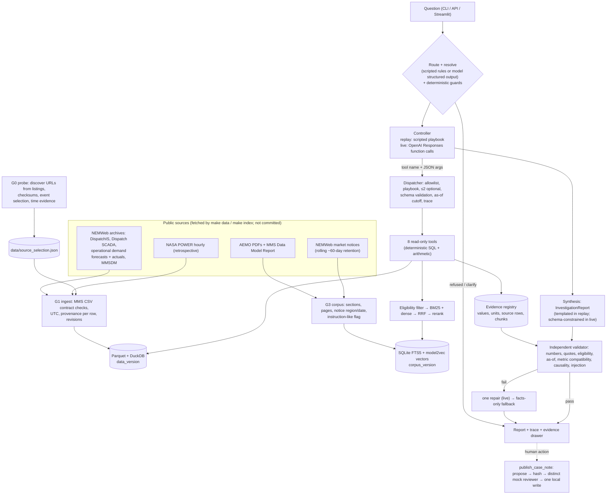

# Architecture

## Components

| Layer | Module | Responsibility |
| --- | --- | --- |
| Source discovery | `scripts/source_probe.py`, `src/nem_agent/nemweb.py` | Parse NEMWeb listings, validate each URL by response, measure posting lag, choose events, record evidence for the time model |
| Raw cache | `rawstore.py`, `http.py` | Immutable bytes + SHA-256 + original retrieval time; bounded, polite HTTP; labelled cache fallback |
| Parsing | `mmscsv.py`, `aemo_schema.py` | AEMO C/I/D record contract, END-OF-REPORT line count, required fields (schema drift → error) |
| Store | `ingest.py`, `store.py` | Seven Parquet tables with provenance columns; DuckDB views; `trace_row` back to source bytes |
| Tools | `tools/args.py`, `tools/impl.py`, `tools/__init__.py` | Strict argument models (exported as strict JSON schemas), eight handlers, evidence registration |
| Control | `agent/request.py`, `agent/playbook.py`, `agent/dispatcher.py`, `agent/replay.py`, `agent/live.py` | Routing, closed intents, playbooks, pre-execution blocking, scripted replay, Responses API loop |
| Retrieval | `retrieval/corpus.py`, `retrieval/index.py`, `retrieval/search.py`, `retrieval/embed.py` | Chunking with metadata, hybrid index, eligibility-first search |
| Validation | `validation.py` | Independent checks + facts-only fallback |
| Delivery | `service.py`, `api.py`, `app/streamlit_app.py`, `ui_data.py`, `cli.py` | One service for CLI/API/UI; charts at native resolution |
| Safety/eval | `approvals.py`, `evaluation/*`, `ml/experiment.py` | Approval boundary; 40-case suite + baselines; separate quantile experiment |

## Why the tools are bounded

- The model (or the scripted controller) can only name one of eight read-only tools and pass JSON arguments. The
  dispatcher rejects unknown tools, tools outside the intent's playbook, a third optional diagnostic, invalid
  JSON, extra fields, non-NEM regions, over-long ranges and timestamps without an offset. It does this *before*
  any code runs.
- No tool accepts SQL, URLs, file paths or code. Queries are parameterised inside the handlers.
- The request's as-of cutoff is injected into every time-aware tool. A tool argument asking for a later cutoff is
  blocked.
- All arithmetic (errors, means, counts, changes) happens in tool code and is registered as evidence with its
  inputs. The narrative can only restate registered numbers.
- The only write action, `publish_case_note`, is not a tool. It is a separate human-facing flow with
  hash-bound, distinct-reviewer approval and exclusive-create writes.

## Time model (summary)

AEMO timestamps are interval-ending, in NEM market time (fixed UTC+10, confirmed from HTTP Last-Modified headers
and 48 half-hours on both 2025/2026 DST-change trading days). Storage is UTC and display is the region's IANA zone.
`available_at = published_at + margin`, where the margin comes from observed NEMWeb posting lags (166 min for
operational demand, 53 min after interval start for dispatch). Retrospective weather has
`available_at = retrieval time`, so it is excluded from any as-of view. Details: `docs/decisions.md` D4 and D7.
